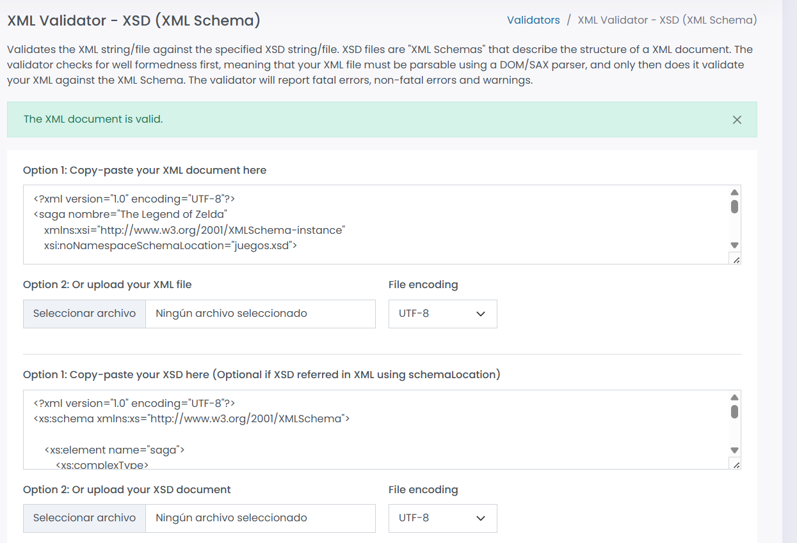

## Descripción del proyecto 

La aplicación es una **enciclopedia web interactiva del universo de The Legend of Zelda**, diseñada para que los usuarios puedan explorar información de toda la saga, buscar contenido en tiempo real, guardar elementos como favoritos y exportar datos del catálogo de juegos.

Su objetivo principal es ofrecer una experiencia centralizada donde los fans puedan consultar personajes, criaturas y elementos del universo Zelda de forma rápida, organizada y persistente.

---

## Tecnologías y herramientas 

Para su desarrollo se utilizan tecnologías ya vistas como HTML, CSS y JavaScript, junto con herramientas como **localStorage** para el almacenamiento local, **Firebase Firestore** para la persistencia de datos y diferentes formatos de intercambio de información como JSON, XML y **CSV**.

### HTML, CSS  y JavaScript

**Son el núcleo de la aplicación**:

- HTML → estructura

- CSS → diseño

- JavaScript → lógica:

    - Llamadas a la API
    - Manejo de eventos
    - Manipulación del DOM
    - LocalStorage
    - Firebase

---

### API externa

#### ¿Qué es una API REST?

Una API REST es un tipo de servicio web que permite a una aplicación comunicarse con otra a través de HTTP, funciona mediante peticiones a URLs llamadas endpoints, y devuelve normalmente datos en formato JSON.

**Se basa en operaciones estándar:**

- GET → obtener datos
- POST → crear datos
- PUT/PATCH → actualizar datos
- DELETE → eliminar datos

En el proyecto utilizo la API de **Zelda** para poder interpretar la información de los distintos tipos de entidades, en el proyecto he elegido estos cuatro:

- Personajes (characters)

- Monstruos (monsters)

- Jefes (bosses)

- Mazmorras (dungeons)

Los endpoints que uso en el proyecto utilizo este patrón [fetch(`${BASE_URL}/${tipo}`)], esto lo que hace es coger directamente el tipo de endpoint que necesitemos.

#### Fetch , Axios y Códigos HTTP

Es una función nativa de JavaScript que permite hacer peticiones HTTP.
https://github.com/indadominguez/Proyecto-__Enciclopedia-Hyrule_Indalecio/blob/6eca15db15ba462bbf6eade55ffdb706c473cd7a/js/api.js#L18-L19

- Envía una petición GET a la API
- Espera la respuesta
- Convierte la respuesta a JSON
- Devuelve los datos para usarlos en la app

A parte de fetch también existe **Axios**, es una librería externa que hace lo mismo que fetch, pero con algunas ventajas:

- Código más limpio
- Manejo automático de JSON
- Mejor gestión de errores
- Interceptores de peticiones

En el trabajo utilizo fetch porque es nativo y no hace falta la instalación de nada.

---

#### Códigos de estado HTTP

Los códigos HTTP indican el resultado de una petición, él más común es el 404 NOT FOUND e índica que el recurso buscado no existe, en mi código controlo los errores con un catch.
https://github.com/indadominguez/Proyecto-__Enciclopedia-Hyrule_Indalecio/blob/6eca15db15ba462bbf6eade55ffdb706c473cd7a/js/ui.js#L126-L128

---

### Firebase y LocalStorage

**1. Firebase**

Se encarga de:

- Guardar favoritos
- Persistencia entre dispositivos
- Almacenamiento en la nube

**2.LocalStorage**

Se encarga de:

- Guarda búsquedas
- Evita llamadas repetidas a la API
- Mejora rendimiento

---

### NPM (Node Package Manager)

Es un gestor de paquetes de JavaScript. 

Permite instalar, actualizar y gestionar las librerias de mi proyecto.

Gracias a **npm**, utilizo el archivo package.json para definir la configuración de mi proyecto y las dependencias y crea la carpeta **node_modules** donde almacena todas las librerías instaladas.

---

## La Zelda API 

Para la zelda api voy a utilizar los Personajes, los Monstruos, los Jefes y las Mazmorras, estas tienen una gran importancia a la hora de pode explorar, resolver puzzles y acertijos y lo más importante derrotar al jefe.
---

## Formatos de datos 
En el desarrollo de aplicaciones y el intercambio de información entre sistemas, es fundamental utilizar formatos que permitan estructurar, transportar y validar datos de manera eficiente. Entre los más utilizados se encuentran XML y JSON, junto con sus respectivos mecanismos de validación: XSD y JSON Schema.

A continuación, se explicará qué es cada uno de estos conceptos, cuáles son sus diferencias principales y en qué situaciones es más adecuado utilizar cada uno.

---

### XML (eXtensible Markup Language)

Es un **lenguaje de marcado** diseñado para **almacenar y transportar datos** de forma estructurada.

- Usa etiquetas (similar a HTML)
- Es extensible y muy flexible
- Legible por humanos y máquinas

### JSON (JavaScript Object Notation)

Es un **formato de intercambio** de datos ligero basado en pares **clave-valor**.

- Sintaxis simple y compacta
- Fácil de leer y escribir
- Muy utilizado en APIs REST
- Compatible con la mayoría de lenguajes

### XSD (XML Schema Definition)

Es un lenguaje que define la estructura y las reglas de un **documento XML**.

- Validar documentos XML
- Definir tipos de datos (string, int, etc.)
- Establecer restricciones (campos obligatorios, longitud, etc.)
- Definir jerarquías

### JSON Schema

Es un lenguaje para definir y validar la estructura de **documentos JSON**.

- Validar datos JSON
- Definir tipos de datos
- Establecer campos obligatorios
- Restringir valores

---

## Esquemas 

### Validación JSON

---

### Validación  XML y XSD

El archivo xml ha sido validado correctamente utilizando el esquema **juegos.xsd**.

Primero es necesario vincular el archivo XMl con el XSD en la parte de arriba del código.

https://github.com/indadominguez/Proyecto-__Enciclopedia-Hyrule_Indalecio/blob/5abf5fda3d44ec5e9b52fa5ed56c4893340a14f1/data/juegos.xml#L2-L4

Ya con el archivo vinculado he creado el xsd como piden las normas de la práctica, haciendo que el validador pase correctamente.

---

## Almacenamiento 

En la aplicación se utilizan dos sistemas de almacenamiento distintos porque cada uno cumple un objetivo diferente dentro de la arquitectura del proyecto.

---

### Local Storage

Se utiliza para almacenar información temporal, especialmente datos que no necesitan ser persistentes ni compartidos entre dispositivos.

**Utilizarlo como caché tienes las siguientes ventajas importantes:**

- Acceso muy rápido: los datos se leen directamente desde el navegador sin necesidad de hacer peticiones a un servidor o a una API externa.
- Reducción de peticiones HTTP: si ya se han cargado datos previamente (por ejemplo, resultados de búsquedas o listados), no es necesario volver a solicitarlos, lo que mejora el rendimiento.
- Funciona sin conexión: incluso si el usuario pierde conexión a internet, la información cacheada sigue disponible.
- Simplicidad de implementación: no requiere configuración ni autenticación.

Un ejemplo dento de la aplicación es si alguien hace la misma busqueda más de una vez, el resultado se guarda y evita hacer de nuevo una llamada a la api.

---

### Limitaciones del Local Storage

Aunque el Local Storage es muy útil tiene varias limitaciones importantes que lo hacen inadecuado para almacenar datos como favoritos:

- No es multi-dispositivo: los datos solo existen en el navegador donde se guardan.
- Se pueden perder fácilmente: si el usuario borra caché o datos del navegador, los favoritos desaparecen.
- No hay seguridad real: cualquier usuario puede modificar los datos desde las herramientas del desarrollador.
- No hay control de usuarios: no existe autenticación ni separación entre usuarios.
- Capacidad limitada: normalmente alrededor de 5MB por dominio.
- No permite consultas complejas: no se pueden hacer filtros avanzados ni búsquedas eficientes.

Por estas razones, solo es adecuado para datos temporales o de mejora de rendimiento, no para información importante del usuario.

---

### Firebase Firestore

Por otro lado, Firestore se utiliza para almacenar datos importantes del usuario, como en este caso la lista de favoritos, ya que estos deben de ser persistentes y accesibles desde cualquier dispositivo.

Las ventajas más importantes son:

- Almacenamiento en la nube: Los datos no dependen del dispositivo, sino de la cuenta del usuario.
- Persistencia real: los favoritos permanecen aunque el usuario cierre sesión o cambie de navegador.
- Escalabilidad y estructura: permite organizar datos por colecciones (usuarios → favoritos → elementos).
- Integración con autenticación: se puede asociar cada documento a un usuario concreto.

---

### Reglas de Seguridad de Firestore

Firestore utiliza un sistema llamado **Security Rules**, que define quién puede leer o escribir datos en la base de datos. Estas reglas son fundamentales para garantizar la seguridad de la aplicación.

Las reglas funcionan como un conjunto de condiciones que se comprueban cada vez que alguien intenta acceder a la base de datos.

- Si el usuario cumple las condiciones → se le permite el acceso
- Si no las cumple → se le bloquea el acceso

Esto hace que Firestore sea una base de datos muy segura si está bien configurada.

**En producción, las reglas se vuelven más estrictas.**

- Solo los usuarios que han iniciado sesión pueden acceder a los datos
- Cada usuario solo puede ver y modificar su propia información
- Se impide el acceso a datos de otros usuarios
- Se pueden definir permisos diferentes según el tipo de dato (por ejemplo, favoritos, perfiles, publicaciones, etc.)

Esto garantiza que cada usuario solo tenga acceso a su propia información.

---

### Alternativas de Almacenamiento

**1. Cookies**

Las cookies son pequeños archivos de datos que el navegador guarda y que pueden ser enviados al servidor en cada petición.

¿Cuándo se usan?

Se utilizan principalmente para guardar información muy básica como sesiones de usuario, preferencias simples o identificadores temporales.

Ventajas:

- Se envían automáticamente al servidor
- Útiles para mantener sesiones iniciadas
- Funcionan de forma sencilla en casi todos los navegadores
- Permiten cierto control desde **el backend**

Desventajas:

- Muy poca capacidad de almacenamiento
- Menos seguras si no se configuran correctamente
- No adecuadas para guardar datos complejos
- Se envían en cada petición, lo que puede afectar el rendimiento

**2. IndexedDB**

IndexedDB es una base de datos integrada en el navegador que permite almacenar grandes cantidades de información de forma estructurada.

¿Cuándo se usa?

Se utiliza en aplicaciones web avanzadas que necesitan trabajar offline o manejar muchos datos en el cliente.

Ventajas:

- Mucho más capacidad que localStorage
- Permite almacenar objetos complejos
- Funciona sin conexión a internet
- Ideal para aplicaciones web **tipo PWA**

Desventajas:

- Más compleja de programar
- No sincroniza datos entre dispositivos
- Depende del navegador del usuario

---

## Decisiones técnicas  

---

## Instrucciones de uso 

